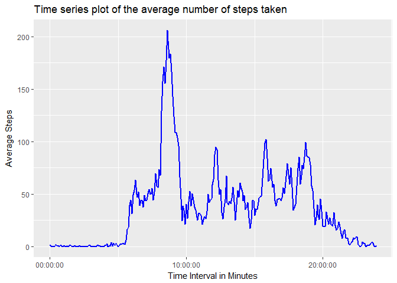
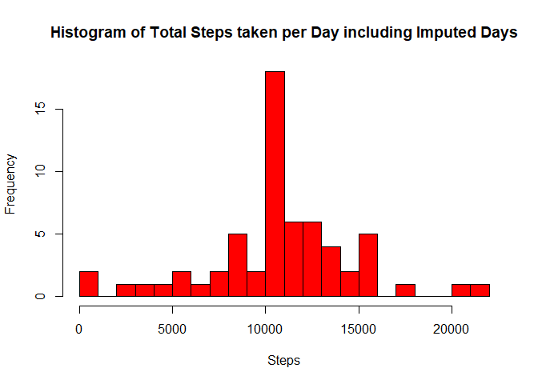
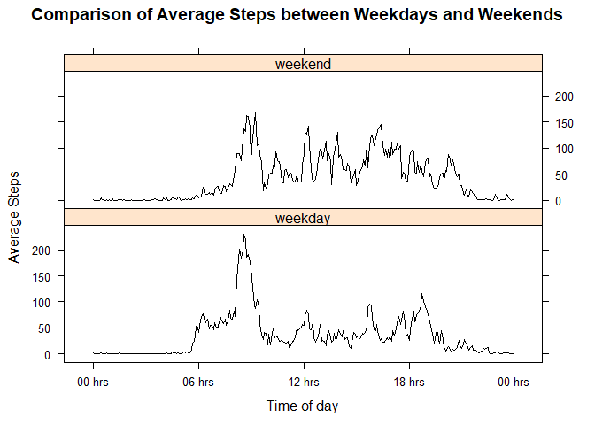

# Project_1
Peter Van Laarhoven  
September 13, 2017  

#1. Code for reading in the dataset and/or processing the data


```r
library(dplyr)
```

```
## 
## Attaching package: 'dplyr'
```

```
## The following objects are masked from 'package:stats':
## 
##     filter, lag
```

```
## The following objects are masked from 'package:base':
## 
##     intersect, setdiff, setequal, union
```

```r
library(tidyr)
library(ggplot2)
library(impute)
library(lattice)
library(hms)

knitr::opts_chunk$set(echo = TRUE)
activity <- read.csv("activity.csv", header = TRUE)
activity <- tbl_df(activity)
```

#2. Histogram of the total number of steps taken each day


```r
activity_grouped <- group_by(activity, date)
activity_sum <- summarise(activity_grouped, sum(steps, na.rm = TRUE))
names(activity_sum) <- c("date", "sum_steps")
hist(activity_sum$sum_steps, breaks = 25, col = "red", xlab = "Steps", main = "Histogram of Total Steps taken per Day")
```

<!-- -->

#3. Mean and median number of steps taken each day


```r
activity_mean <- mean(activity_sum$sum_steps)
activity_median <- median(activity_sum$sum_steps)
```

The mean number of steps is 9354.  
The median number of steps is 10395.  

#4. Time series plot of the average number of steps taken


```r
time_group <- group_by(activity, interval)
time_mean <- summarise(time_group, mean(steps, na.rm = TRUE))
names(time_mean) <- c("interval", "mean_steps")
time_mean$interval <- sprintf("%04d", time_mean$interval)
time_mean$interval <- as.POSIXct(time_mean$interval, format = "%H%M")
time_mean$interval <- format(time_mean$interval, "%H:%M:%S")
time_mean$interval <- as.hms(time_mean$interval, "%H:%M:%S")

p <- ggplot(time_mean, aes(interval, mean_steps)) + geom_line(size = 1, color = "blue") + labs(x = "Time Interval in Minutes", y = "Average Steps", title = "Time series plot of the average number of steps taken") + guides(fill=FALSE) 
print(p)
```

<!-- -->

#5. The 5-minute interval that, on average, contains the maximum number of steps


```r
time_max <- time_mean$interval[which.max(time_mean$mean_steps)]
```

This time interval is from 3.09\times 10^{4} - 3.09\times 10^{4}.

#6. Code to describe and show a strategy for imputing missing data

###To find the percentage of step values that are missing         

```r
percent_na <- (sum(is.na(activity$steps)) / length(activity$steps)) * 100
```
### Missing values make up 13.1% of the values.  That is a reasonable number for imputation.

### Lets look at the NAs to get an idea of what is missing


```r
nas <- activity[which(is.na(activity$steps)),]
table(nas$date)
```

```
## 
## 2012-10-01 2012-10-02 2012-10-03 2012-10-04 2012-10-05 2012-10-06 
##        288          0          0          0          0          0 
## 2012-10-07 2012-10-08 2012-10-09 2012-10-10 2012-10-11 2012-10-12 
##          0        288          0          0          0          0 
## 2012-10-13 2012-10-14 2012-10-15 2012-10-16 2012-10-17 2012-10-18 
##          0          0          0          0          0          0 
## 2012-10-19 2012-10-20 2012-10-21 2012-10-22 2012-10-23 2012-10-24 
##          0          0          0          0          0          0 
## 2012-10-25 2012-10-26 2012-10-27 2012-10-28 2012-10-29 2012-10-30 
##          0          0          0          0          0          0 
## 2012-10-31 2012-11-01 2012-11-02 2012-11-03 2012-11-04 2012-11-05 
##          0        288          0          0        288          0 
## 2012-11-06 2012-11-07 2012-11-08 2012-11-09 2012-11-10 2012-11-11 
##          0          0          0        288        288          0 
## 2012-11-12 2012-11-13 2012-11-14 2012-11-15 2012-11-16 2012-11-17 
##          0          0        288          0          0          0 
## 2012-11-18 2012-11-19 2012-11-20 2012-11-21 2012-11-22 2012-11-23 
##          0          0          0          0          0          0 
## 2012-11-24 2012-11-25 2012-11-26 2012-11-27 2012-11-28 2012-11-29 
##          0          0          0          0          0          0 
## 2012-11-30 
##        288
```
### From this table we can see that 8 entire days are missing all data.  This violates a major rule for the applicability of imputation: The data are not Missing Completely at Random (MCAR).  This means imputation is not appropriate, but for the sake of this excercise, we will continue.   


```r
#The data is spread into a wide data set for ease of imputation
activity2 <- activity %>% spread(interval, steps)

#The date is removed leaving only numbers for the analysis,  This can be added back later.
activity3 <- activity2
activity3$date <- NULL

#The data is converted to a numeric matrix for imputation
activity3 <- data.matrix(activity3)

#To impute the NAs, the mean of the column will be substituted

imputer <- function(x){
        for (j in 1:61){
                for (i in 1:288){
                        if (is.na(x[j,i])){
                                x[j,i] <- mean(x[,i], na.rm = TRUE)   
                        }
                        else{
                                x[j,i] <- x[j,i]
                        }
                }        
        }
return(x)        
}

imputed <- imputer(activity3)
imputed <- round(imputed, digits = 0)
```

#7. Histogram of the total number of steps taken each day after missing values are imputed


```r
imputed_sum <- rowSums(imputed)
hist(imputed_sum, breaks = 25, col = "red", xlab = "Steps", main = "Histogram of Total Steps taken per Day including Imputed Days")
```

<!-- -->


#8. Panel plot comparing the average number of steps taken per 5-minute interval across weekdays and weekends


```r
#Need to extract dates from the original dataset and reapply them to the imputed data
dates <- as.character(unique(activity$date))

#The imputed data is first made into a data frame to retain the numeric class of "imputed"
imputed2 <- as.data.frame(imputed)

#The dates are added to the data frame as the first row 
imputed3 <- cbind(dates, imputed2)
imputed3$dates <- as.Date(imputed3$dates)

#The "imputed" object is in "wide" format and must be converted to "tall" format.
imputed4 <- imputed3 %>% gather(interval, steps, -dates)

#The time interval is converted back to class:numeric
imputed4$interval <- as.integer(imputed4$interval)

#The imputed4 object is sorted by date then time interval to convert it back to the format of the original dataset
imputed5 <- arrange(imputed4, dates, interval)

#The day of the week is extracted from the date and put into a new column
imputed5 <- mutate(imputed5, day = weekdays(imputed5$dates))

#The day of the week is converted to "weekday" or "weekend" using regular expressions
imputed5$day <- gsub("Monday|Tuesday|Wednesday|Thursday|Friday", "weekday", imputed5$day) %>% gsub("Saturday|Sunday", "weekend", .)

#The data is grouped by the contents of the "day" column then by "interval"
imputed5 <- group_by(imputed5, day, interval)
imputed6 <- summarize(imputed5, mean(steps))
imputed6$`mean(steps)` <- round(imputed6$`mean(steps)`, digits = 1)

#The interval is converted to POSIXct for  
imputed6$interval <- sprintf("%04d", imputed6$interval)
imputed6$interval <- as.POSIXct(imputed6$interval, format = "%H%M")

u <- xyplot(imputed6$'mean(steps)' ~ imputed6$interval | imputed6$day, type = c("l"), pch = 20, lty = 1, lwd = 1, layout = c(1,2), col.line = "black", xlab = "Time of day", ylab = "Average Steps", main = "Comparison of Average Steps between Weekdays and Weekends", scales=list(x=list(at= seq(as.POSIXct(imputed6$interval[[1]]), by = "6 hour", length = 5), labels = format(seq(as.POSIXct(imputed6$interval[[1]]), by = "6 hour", length = 5), "%H hrs"))))
print(u)
```

<!-- -->
